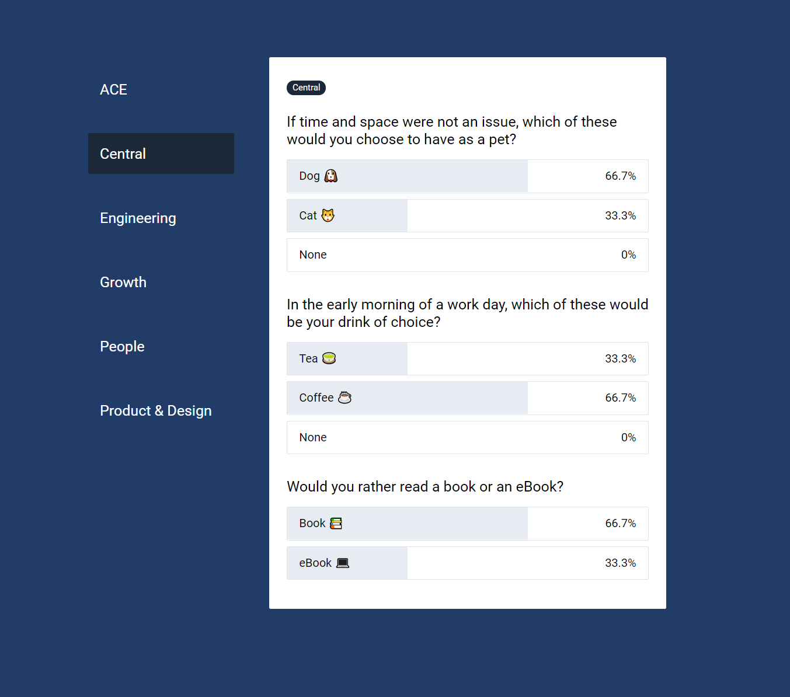

# Engineering Test

This is a frontend engineering test using Vue.

## User Requirements

For our Careers page we asked different departments within Attest questions to get to know them.
Do they prefer coffee or tea, dogs or cats, and things like that.

You can find the data for this in ./src/questions.ts

For this test implement a one page application that shows off this information,
and allows the user to interact with it.

 * It should list the questions.
 * For each department it should show their answers for the questions.
 * There should be some way for the user to interact with it.

Here is a screenshot of an example solution:

This project includes an example template project to get started using the Vue CLI. If you wish you are free to use different tooling.

 * You are free to change how it looks.
 * You are free to change how it works.
 * You are free to change any of this template project, or use your own.

Please also include some tests.

## Style Information

Attest has a style guide which is used across our products. You are not required to use it.

However if you wish to you can find it [here](https://attest.invisionapp.com/dsm/attest-technologies-ltd/adsl-v-2).

